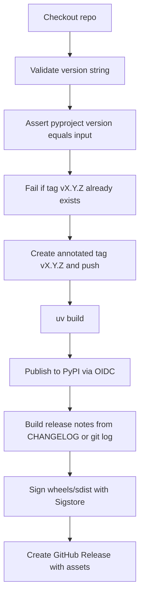

# Release cycle

This document describes how **codegraph-mcp** goes from source on the default branch to a **PyPI** package and a
**GitHub Release**. Automation lives in [`.github/workflows/release.yml`](../.github/workflows/release.yml).

## Concepts

| Piece                                    | Role                                                                               |
| ---------------------------------------- | ---------------------------------------------------------------------------------- |
| **`pyproject.toml` → `project.version`** | Single source of truth for the version baked into wheels/sdists.                   |
| **Git tag `vX.Y.Z`**                     | Points at the commit you are releasing; created by the workflow.                   |
| **PyPI**                                 | Public index users install from (`pip install codegraph-mcp`).                     |
| **GitHub Release**                       | Human-facing notes and downloadable `.whl` / `.tar.gz` (plus Sigstore signatures). |

Publishing uses **PyPI trusted publishing** (OIDC): no long-lived PyPI token in GitHub secrets if you configure the
publisher correctly. See [PyPI: Trusted publishers](https://docs.pypi.org/trusted-publishers/).

## One-time setup (maintainers)

Do this once per repository (or when rotating configuration).

### 1. PyPI

1. Create the **codegraph-mcp** project on PyPI (or claim it if reserved).
2. **Settings → Publishing → Add a new pending publisher** (or equivalent):
   - **PyPI project name:** `codegraph-mcp`
   - **Owner / repository:** your GitHub org or user and this repo
   - **Workflow name:** `release.yml`
   - **Environment name:** `pypi`

### 2. GitHub

1. **Settings → Environments → New environment** named exactly **`pypi`**.
2. Optional: add **required reviewers** or **deployment branches** so only trusted people can run the release workflow.

Until both sides match (environment name `pypi`, workflow `release.yml`), the publish step will fail with an OIDC /
permission error.

## Regular release (every version)

The workflow is **manual** (`workflow_dispatch`). It does **not** edit `pyproject.toml`; you bump the version in git
first.

### Checklist

1. **Merge a version bump** on the default branch (`main`, etc.):

   - Set `version = "X.Y.Z"` under `[project]` in [`pyproject.toml`](../pyproject.toml).
   - Add a section in [`CHANGELOG.md`](../CHANGELOG.md) for that version, for example:
     ```markdown
     ## [0.2.0]

     - Your bullet points for users.
     ```
     If this section is missing or empty, the workflow still runs but fills GitHub Release notes from `git log` and
     prints a warning.

2. **Run the workflow**

   - GitHub → **Actions** → **Release** → **Run workflow**.
   - **version:** must match `pyproject.toml` **exactly** (e.g. `0.2.0`).
   - **prerelease:** check if this is a beta/rc GitHub Release (PyPI still gets the same version string).

3. **Verify**

   - Package appears on [PyPI: codegraph-mcp](https://pypi.org/p/codegraph-mcp).
   - **Releases** on GitHub shows **CodeGraph MCP vX.Y.Z** with notes and assets.

### Version format

The workflow accepts **PEP 440–style** semver strings such as:

- `0.1.0`
- `0.2.0-beta.1`

It rejects malformed strings before any tag or build runs.

## What the workflow does (order)



1. **Validate** the workflow input against a regex (semver + optional prerelease suffix).
2. **Verify** `project.version` in `pyproject.toml` equals the input — if not, the run stops with a clear error.
3. **Refuse** to continue if tag `vX.Y.Z` already exists locally.
4. **Tag** the current `HEAD` as `vX.Y.Z` and **push** the tag to `origin`.
5. **Build** with `uv build` (wheel + sdist).
6. **Publish** to PyPI using `pypa/gh-action-pypi-publish` and the **`pypi`** environment.
7. **Release notes:** extract the `## [X.Y.Z]` block from `CHANGELOG.md`, or fall back to `git log` since the previous
   tag.
8. **Sign** artifacts with Sigstore.
9. **GitHub Release:** upload distributions and signatures; mark as prerelease if you checked the prerelease box.

## CI before release

Pull requests and pushes to `main` / `master` / `develop` run
[`.github/workflows/test.yml`](../.github/workflows/test.yml) (Ruff, mdformat, Mypy, pytest on multiple OS/Python
versions). Releases are not gated automatically by that workflow; keep CI green before tagging.

## Troubleshooting

| Symptom                                  | Likely cause                                                                                                                                   |
| ---------------------------------------- | ---------------------------------------------------------------------------------------------------------------------------------------------- |
| “pyproject.toml version is … expected …” | Workflow **version** input does not match `[project].version` on the branch you ran from. Fix `pyproject.toml` or the input.                   |
| “Tag v… already exists”                  | That version was already tagged. Bump to a new version in `pyproject.toml` or delete the remote tag (only if you know it was never published). |
| PyPI OIDC / permission errors            | Trusted publisher on PyPI or GitHub **Environment** name `pypi` does not match the workflow.                                                   |
| Empty or wrong release notes             | No `## [X.Y.Z]` section in `CHANGELOG.md` for that version; workflow falls back to git history.                                                |

## See also

- [README: CI and PyPI releases](../README.md#ci-and-pypi-releases) (short summary)
- [CHANGELOG.md](../CHANGELOG.md)
